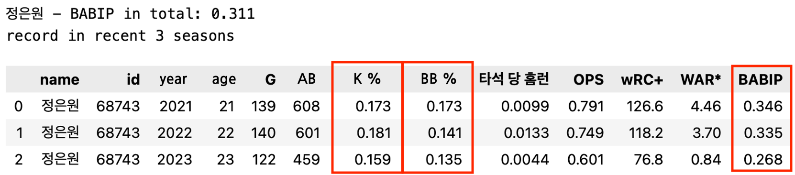
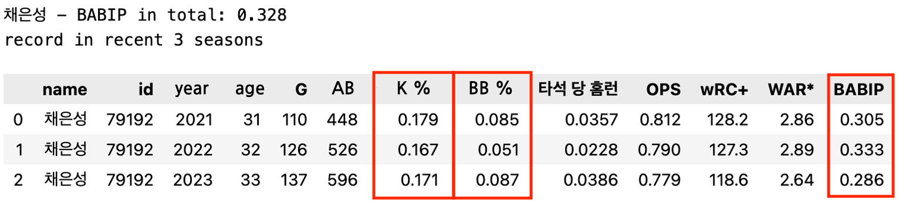
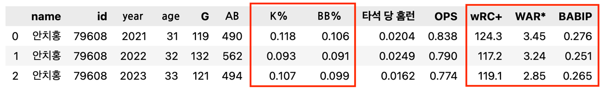

# Projec Hangang Gang
**Can Hanwha Eagles be rehabilitated into a strong team?**  

Project 한강 Gang(**한**화 이글스를 **강**팀으로 **갱**생시킬 수 있을까?)
- 2024-spring Data Science Lab EDA(Exploratory Data Analysis) Project Sports Data Team  
- Team Members: Sung Oh Jung(team leader), Yeongho Kim, Ji Won Kim, Jung Woo Kim
- Detailed Dataset Type: **baseball data of Korean professional baseball league(KBO league)**
- Main Topic  
    There is a team **Hanwha Eagles**, which is an icon of defeat, in KBO league.   
    <ins>**Why didn't the Hanwha Eagles become a strong team?**</ins>
- Project Presentation Material: [link](./DSL_EDA_SPORTS.pdf)

# Project Summary

## 1. Dataset

### 1. (1) Description of Dataset
1. foreign_player_list: basic data on KBO foreign players from 2014 to 2024 (year, team, registered name, full name, position, nationality, etc.)

1. gamedata: records of hitters, pitchers, and game results for each game between 2017 and 2023

1. hitter_detailed_stats: annual detailed records of each hitter

1. hitter_tracking_data: tracking data for batted balls of each hitter between 2021 and 2023

1. hitterRecords: yearly basic records of each hitter

1. KBO_Team_rank_stat: records of ranking, winning rate, overall batting, overall pitching, overall defense, and overall base running by KBO teams from 2014 to 2023

1. pitcher_tracking_data: tracking data for batted balls of each pitcher by pitch kind between 2021 and 2023

1. pitcher_detailed_stats: yearly detailed records of each pitcher

1. pitcherRecords: yearly basic records of each pitcher

1. playerInfo: each player's name, unique player ID, back number, birthday, position, pitching/hitting hand, height, weight, team, annual salary 

1. playerPositions_2023: defense position data for each player in 2023

1. validPlayerId: valid ID of each player used to search for players in [KBO 기록실](https://www.koreabaseball.com/Record/Player/HitterBasic/Basic1.)

### 1. (2) Data Source
All data were collected on the websites below by using [BeautifulSoup(bs4)](https://www.crummy.com/software/BeautifulSoup/bs4/doc/) or [Selenium](https://www.selenium.dev/).

- [KBO 기록실](https://www.koreabaseball.com/Record/Player/HitterBasic/Basic1.aspx)
- [STATIZ](http://www.statiz.co.kr/main.php)
- [Naver Sports](https://sports.news.naver.com/index.nhn)
- [Sports2i](https://m.2itracking.com/)

## 2. Purpose of Project
### Main Purpose
> Identifying why the performance of the KBO team Hanwha Eagles has been bad so far, and Analyzing whether Hanwha Eagles is likely to rebound

### Order of Analysis
1. Looking at Hanwha Eagles' rankings and records over the past decade
1. Focusing on analyzing the records in 2018 which is the only year when Hanwha Eagles performed well
1. Based on analysis of records in 2023, analyzing whether Hanwha Eagles is likely to rebound

## 3. Summary of Analysis

### 3. (1) Looking at Hanwha Eagles' rankings and records over the past decade

- *Hanwha Eagles Rankings by Year*  
The Hanwha Eagles has finished each season **<u>below sixth every year except 2018</u>**. 
    

- *Hanwha Eagles Batting Average by Year*  
    The Hanwha Eagles has ranked below 7th in batting average every year except in 2017.
    

- *Hanwha Eagles ERA(Earned Run Average) by Year*  
    The Hanwha Eagles' ERA standings have remained at the bottom level of the standings every year except in 2018.
    

- *Hanwha Eagles WAR of Foreign Players by Year*  
    Foreign players chosen by Hanwha Eagles have consistently performed worse than foreign players from other teams.

    

## 3. (2) Focusing on analyzing the records in 2018 which is the only year when Hanwha Eagles performed well

> Hanwha Eagles finished the season in 3rd place in 2018. What was the biggest difference in that year from other years?

### 3. (2). a - Overall Pitchers

<ins>**Pitchers**</ins> were <ins>**the biggest contributor**</ins> to the Hanwha Eagles' good performance in 2018. Hanwha Eagles pitchers' BABIP in 2018 was average, so it was difficult to say that the pitchers were lucky. Nevertheless, they performed substantially well in both the ERA and FIP.

### 3. (2). b - Starting Pitcher

In 2018, Hanwha Eagles starting pitchers' pitched innings did not differ significantly from the previous year and the following year.

### 3. (2). c - Relief Pitcher

In 2018, Hanwha Eagles relief pitchers' K/BB did not differ significantly from the previous year and the following year.

### 3. (2). d - Hitter

In 2018, Hanwha Eagles hitters' batting average did not differ significantly from the previous year and the following year.

### 3. (2). e - Conclusion
**In 2018**, **the overall performance of hitters and pitchers for the Hanwha Eagles did not change much** compared to the previous year and the following year. However, <ins>**because pitchers from other teams threw very poorly**</ins>, *Hanwha Eagles pitchers performed relatively well* despite showing similar skills to other years. **As a result, the surprising performance of Hanwha Eagles in 2018 can be attributed to the sudden failure of pitchers from other teams to throw in the year.**

## 3. (3) Based on analysis of records in 2023, analyzing whether Hanwha Eagles is likely to rebound

### 3. (3). a - Analysis of Records in 2023

- Hitter WAR by team in 2023
    
    We can conclude that Hanwha Eagles hitters did very poorly in 2023, since they ranked last in WAR and wRC+.

- ERA - FIP by team in 2023
    
    Hanwha Eagles pitchers ranked seventh in the FIP, but ERA was eighth. And since they ranked seventh in the ERA - FIP ranking, it can be said that pitchers were not helped by their defense.

- regression line between ERA and FIP - Hanwha Eagles pitchers(red) vs other team pitchers(blue)

    

- Conclusion  
    | Hitter | Defence | Pitcher |
    |:---:|:---:|:---:|
    |very bad|very bad| bad |

### 3. (3). b - Analyzing whether Hanwha Eagles is likely to rebound

#### Players who are expected to have better records
##### 1. Eunwon Jung(정은원)

K\% $\downarrow$, BB\% $\downarrow$  
BABIP $\downarrow \downarrow$  
If he lowers the launch angle of the ball and produces more line-drive hits like before, he will likely get better records.

##### 2. Eunseong Chae(채은성)

K\% similar, BB\% similar, exit velocity $\uparrow$, hard hit\% $\uparrow$    
BABIP $\downarrow \downarrow$  
As long as the BABIP returns to average next season, he is expected to perform much better.

##### 3. Dongju Moon(문동주)

Dongju Moon(문동주), KBO League rookie of the year last season, had an inning limit last year. This year, however, he is expected to have an improved record by throwing without the inning limit.

#### Players who are expected to have lower records

##### 1. Hyunsang Ju(주현상)

K\% $\uparrow$, FIP $\downarrow$, BABIP $\downarrow \downarrow$, slider $\uparrow \uparrow$  
Hyunsang Ju(주현상)'s slider got very good last season. However, despite this improved aspect, his performance came out much better than expected. Considering the BABIP figures and FIP, it can be concluded that he was really lucky. As a result, he will be difficult to perform better than last season, even though he will still be a good pitcher this season.

##### 2. Daekyung Yun(윤대경)

FIP $\uparrow$, BABIP $\downarrow \downarrow$, fast ball $\uparrow$  
Daekyung Yun(윤대경)'s fastball movement and RPM have gotten better. But even with these improvements, his FIP was the highest in the last four years and his BABIP was the lowest in the last four years. Considering these points, it can be concluded that he was very lucky last season. If BABIP comes back to average, his performance is highly likely to drop.

#### New Player
##### 안치홍

K\% similar, BB\% similar, BABIP similar, exit velocity $\downarrow$  
Except for the drop in exit velocity, all hitting records including K\% and BB\% are stable for a long time, so he is expected to yield similar results to last season. He is a clear plus factor for Hanwha Eagles' weak batting lineup.

#### Conclusion
The Hanwha Eagles' <ins>**pitchers**</ins> are expected to **perform a little below average**, similar to last year. The <ins>**hitters' performance**</ins> is expected **to be better than last season**. Even if it does, however, it will **still be worse than average**, because the team's hitting performance was the poorest last season. Therefore, <ins>**defense**</ins> will likely <ins>**determine Hanwha's rank in this season**</ins>. **If Hanwha's defense becomes better** than last season and assists pitchers, **Hanwha may be able to even aim for the middle spot at the ranking**.

